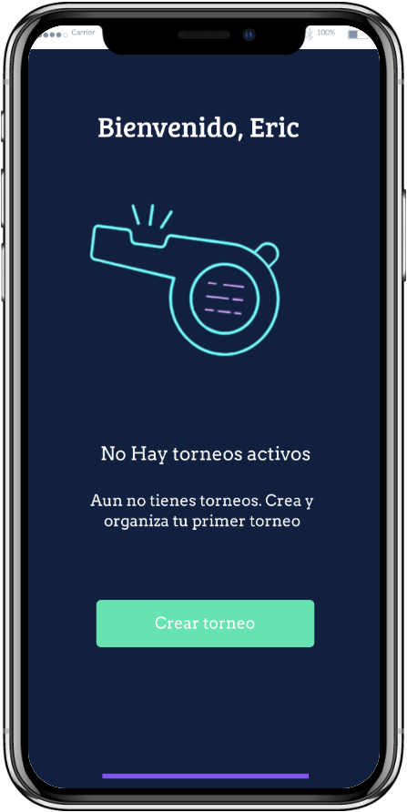
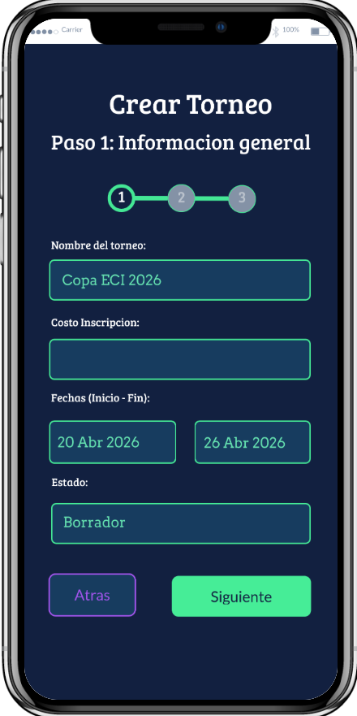
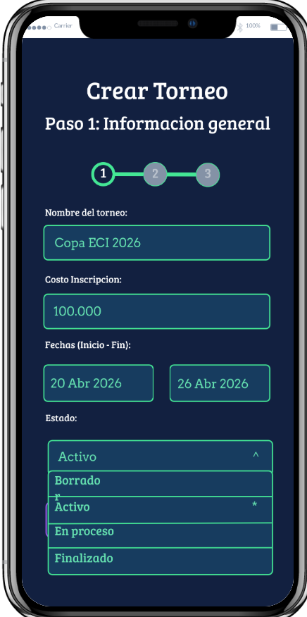
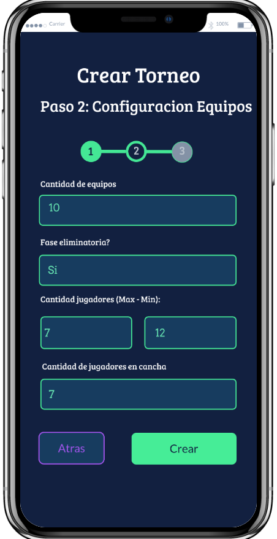
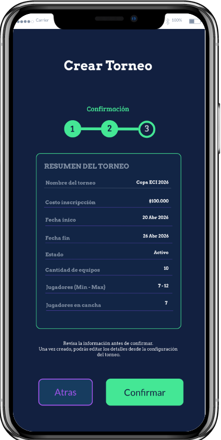
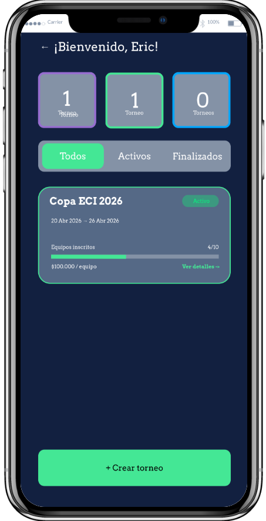
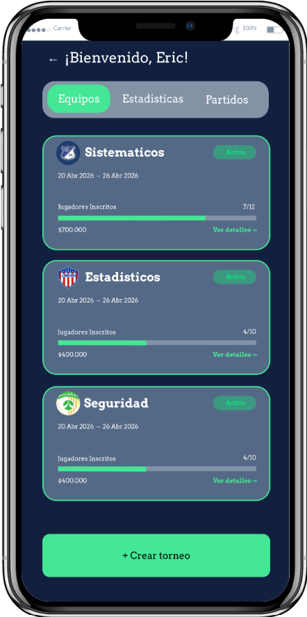
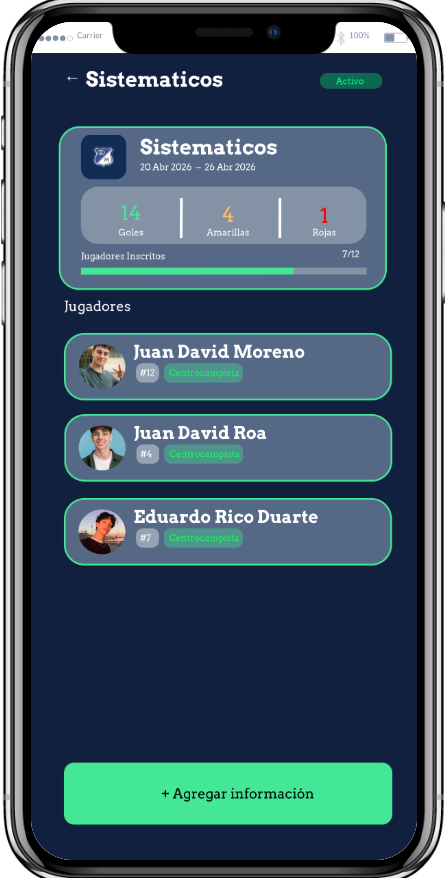

| Mockup                                                  | Descripción                                                                                                                                                     |
|---------------------------------------------------------|-----------------------------------------------------------------------------------------------------------------------------------------------------------------|
| **ID**                                                  | TF-20                                                                                                                                                           |
|            | Despues de crear cuenta o iniciar sesión, si no hay torneos creados se mostrara esta pantalla para poder crear uno.                                             |
|   | Luego de darle click en el boton de "Crear botón", encontraremos un formulario que consta de dos pasos, en el primer paso, se eligira los datos del torneo.     |
|  | En el paso 1, hay una seccion que es para elegir el estado del torneo, al darle click en el campo se desplegara las opcciones posibles.                         |
|  | En este paso 2, los datos que se piden corresponden al equipo.                                                                                                  |
| | Finalmente, al darle click en el boton crear, se genera un resumen para poder confirmar el torneo.Al darle clic, en confirmar, aparecera la siguiente pantalla. |
 || Aqui apareceran todos los torneos, tenemos 3 secciones **Todos**, **Activos**, **Finalizados**.                                                                 |
 | | Al darle clic en ver detalles del torneo apareceran todos los equipos inscritos hasta el momento.                                                               |
| | Luego, podemos ver los detalles de cada  equipos, con susrespectivos jugadores, amarillas, rojas y goles.                                                       |